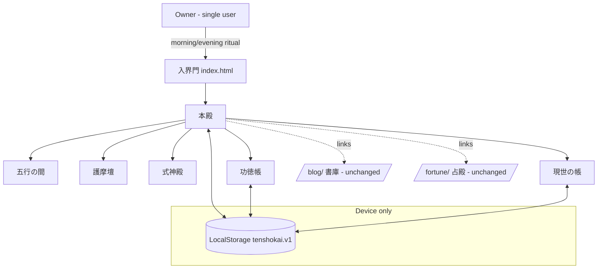
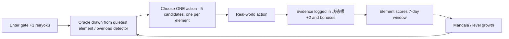

# 天照界 (Tenshokai) — MY WORLD Architecture

Personal digital sanctuary replacing the takuyahirata.com top page.
A "personal world-creation OS": the ideal world is defined first, then
grown through daily rituals and real-world evidence.

Spec origin: operator-provided MY WORLD specification (2026-08-26).
Personalization axis: 解放 — returning time, margin, and agency to the owner.

## System Context

## Data Flow (daily loop)

## Component Responsibilities

| File | Responsibility |
|---|---|
| `index.html` | SPA shell — all views' markup (gate, hall, wish hall, elements, goma, shikigami, merit ledger, offering hall, real ledger), meta, JSON-LD |
| `assets/js/unki.js` | Owner's daily fortune: sexagenary day cycle (two published anchors verified), stem-element relation to the owner's day stem (derived constant only — no raw birth data), 5 day-qualities with no negative grade |
| `assets/tenshokai.css` | Design system: 漆黒/鈍金/朱 palette, fuda buttons, flame/burn animation, view fades |
| `assets/js/data.js` | Content layer: oracles, declarations, element map, shikigami seeds, growth constants |
| `assets/js/state.js` | State layer: LocalStorage store, element scoring, oracle selection, overload detection, reiryoku/level |
| `assets/js/mandala.js` | Procedural SVG: world sigil (界紋) + level-driven mandala |
| `assets/js/audio.js` | WebAudio synthesis: bell, fire crackle, drone — no audio files, never autoplays |
| `assets/js/app.js` | Application layer: view switching, ritual flows, forms, goma burn sequence |

## External Communication Guarantees

- Zero backend, zero API calls, zero analytics on the world page.
- Only external request: Google Fonts (Shippori Mincho B1).
- All personal data (actions, evidence, ledger numbers) lives ONLY in the
  visitor's own LocalStorage — never transmitted, never shared between devices.
- Goma (released thoughts): the text itself is NEVER stored — only
  timestamp + category.
- `/blog/` and `/fortune/` are untouched legacy sections; previous top page
  preserved at `legacy/index-v1-shisoka.html`.

## Design Constraints (owner-specific)

- ADHD-aware: exactly one action per day, candidates pre-decided with a
  recommended pick, morning ritual reachable in under 30 seconds.
- Depression-aware: no streaks, no punishment for missed days; rest (土)
  counts as a world-protecting action.
- Overload detection: 3+ unfinished chosen actions in the last 5 ritual days
  switches the oracle to release mode ("what can be reduced"), and the
  recommended action becomes rest.
- No scarcity language anywhere in the primary screens; real numbers shown
  plainly (never beautified) only in 現世の帳.
- Internal system names are never exposed; shikigami carry poetic public-safe
  names the owner can rename.

## 願殿 — Manifestation as a Loop (not magic)

The wish hall implements attraction as a verifiable loop: wish written in
already-unfolding phrasing → daily mantra repetition (呪, chanted in the
main hall) → one small action → evidence in the merit ledger → fulfillment
(成就) recorded as evidence. Design rules:

- Max 3 active wishes (focus over accumulation); each wish carries a
  first-step small enough for a low-energy day.
- Subconscious rewrite = goma ritual extension: the old belief burns
  (never stored), the replacement belief is inscribed as a mantra and
  resurfaces every morning. This is cognitive reframing in the world's
  grammar, not therapy.
- Explicit boundary line in the wish hall: deep wounds belong with
  professionals ("専門家という同行者も、世界の外にいる").
- Nothing is guaranteed anywhere in the copy; the world credits actions
  and evidence, never promises outcomes.
